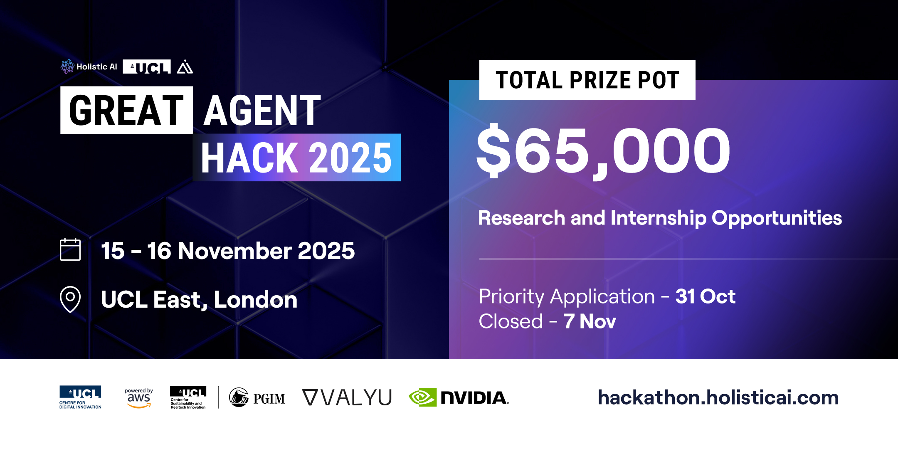

<div align="center">



# Holistic AI x UCL Hackathon 2025

**Build Production-Grade AI Agents | November 15-16, 2025 | London**

[](https://hai-great-agent-hack-2025.devpost.com)
[](https://discord.com/invite/QBTtWP2SU6?referrer=luma)
[](https://hackathon.holisticai.com/)

**$65,000 Prize Pool | 3 Tracks | 2 Days | Production-Ready Agents**

[Website](https://hackathon.holisticai.com/) • [Register & Submit (Devpost)](https://hai-great-agent-hack-2025.devpost.com) • [Discord](https://discord.com/invite/QBTtWP2SU6?referrer=luma) • [📅 Event Schedule](./docs/EVENT_SCHEDULE.md) • [Rules](./docs/HACKATHON_RULES.md) • [Judging & Prizes](./docs/Judging_Prize.pdf)

</div>

---

## 🚀 Quick Start - Get Running in 10 Minutes

Get your first AI agent running quickly. No prior experience needed.

### ⚡ Fast Track (5 commands)

```bash
# 1. Clone repository
git clone https://github.com/holistic-ai/hackthon-2025.git && cd hackthon-2025

# 2. Install dependencies
pip install -r requirements.txt

# 3. Configure environment
cp .env.example .env
# Edit .env with your API keys (see below)

# 4. Start Jupyter
jupyter notebook

# 5. Open tutorials/01_basic_agent.ipynb and run it!
```

**Done!** Your first agent should be running. ✅

### 🔑 Getting API Keys

**During the Hackathon:**
1. Form your team (3-5 members)
2. Join [Discord](https://discord.com/invite/QBTtWP2SU6?referrer=luma)
3. DM **Zekun Wu** (`@zekunwu_73994`) to receive:
   - API keys (AWS Bedrock credentials)
   - AWS SageMaker Notebook Instance access
   - Other hackathon resources
4. Add credentials to `.env`:
   ```bash
   HOLISTIC_AI_TEAM_ID=your-team-id
   HOLISTIC_AI_API_TOKEN=your-token
   ```

**Before the Hackathon:** Credentials sent to registered teams via email.

📚 **Resources:** [API Guide](./assets/api-guide.pdf)

### 🎯 Next Steps

1. **Pick a track**: [Track A](#track-a-agent-iron-man) | [Track B](#track-b-agent-glass-box) | [Track C](#track-c-dear-grandma)
2. **Complete tutorials**: See [tutorials/README.md](./tutorials/README.md)
3. **Start building**: Use `core/` folder or build from scratch

<details>
<summary><b>🆘 Common Issues</b></summary>

**"Module not found"**
```bash
pip install -r requirements.txt --force-reinstall
```

**"API key not found"**
```bash
# Check .env file exists and has correct values
cat .env
```

**Jupyter won't start**
```bash
pip install jupyter
jupyter notebook --port=8889
```

**Still stuck?**
- **Discord** (fastest): [#ask-for-help](https://discord.com/invite/QBTtWP2SU6?referrer=luma)
- **GitHub Issues**: [Report a bug](https://github.com/holistic-ai/hackthon-2025/issues/new/choose)
- **Contact**: `@zekunwu_73994` on Discord

</details>

## 📅 Timeline & Important Dates

| Event                   | Date & Time (GMT)                        |
| ----------------------- | ---------------------------------------- |
| **Registration Opens**  | November 1, 2025                         |
| **Event Day 1**         | November 15, 2025, 9:00 AM - 7:30 PM GMT |
| **Track Release**       | November 15, 2025, **10:45 AM GMT** 🚀   |
| **Event Day 2**         | November 16, 2025, 9:00 AM - 6:00 PM GMT |
| **Submission Deadline** | November 16, 2025, **3:00 PM GMT** ⏰    |
| **Winners Announced**   | November 16, 2025, **5:00 PM GMT** 🏆   |

> ⚠️ **Late submissions will not be accepted.** Devpost timestamps are final.

**📋 Full Schedule**: [View detailed event schedule →](./docs/EVENT_SCHEDULE.md)

## 🏆 Three Tracks, Three Challenges

Choose your path — compete in one track or all three! Each track is judged separately.

**Click on any track below to view detailed information, tutorials, and requirements:**

<table>
<tr>
<td width="33%" valign="top">

### [Track A: Agent Iron Man](./track_a_iron_man/)

**Build agents that don't break.**

Performance, Robustness, Cost Efficiency

</td>
<td width="33%" valign="top">

### [Track B: Agent Glass Box](./track_b_glass_box/)

**Follow the trajectory. Understand the behavior.**

Observability, Explainability, Transparency

</td>
<td width="33%" valign="top">

### [Track C: Dear Grandma](./track_c_dear_grandma/)

**Attack like a red-team. Assess like a professional.**

Security, Red Teaming, Vulnerability Discovery

</td>
</tr>
</table>

## 📚 Learning Resources

**New to AI agents?** Start with our tutorials. **Ready to build?** Jump to your track's guide.

### Tutorials

8 notebooks covering basics to production: [View all →](./tutorials/README.md)

- [`01_basic_agent.ipynb`](./tutorials/01_basic_agent.ipynb) — Build your first ReAct agent
- [`02_custom_tools.ipynb`](./tutorials/02_custom_tools.ipynb) — Create custom tools
- [`03_structured_output.ipynb`](./tutorials/03_structured_output.ipynb) — Get validated JSON responses
- [`04_model_monitoring.ipynb`](./tutorials/04_model_monitoring.ipynb) — Track performance & costs
- [`05_observability.ipynb`](./tutorials/05_observability.ipynb) — Deep tracing with LangSmith
- [`06_benchmark_evaluation.ipynb`](./tutorials/06_benchmark_evaluation.ipynb) — Test on benchmarks
- [`07_reinforcement_learning.ipynb`](./tutorials/07_reinforcement_learning.ipynb) — RL training (optional)
- [`08_attack_red_teaming.ipynb`](./tutorials/08_attack_red_teaming.ipynb) — Security testing

### Additional Resources

See each track's README for code examples, datasets, and additional resources:

- [Track A Resources](./track_a_iron_man/) — Code examples and benchmarks
- [Track B Resources](./track_b_glass_box/) — Observability case studies and traces
- [Track C Resources](./track_c_dear_grandma/) — Red teaming datasets and benchmarks

## 📤 Submission

**Submit via Devpost**: [Submit Now →](https://hai-great-agent-hack-2025.devpost.com)

**Team Requirements**: 3-5 members (form teams on-site at UCL East - Marshgate, London)

**Required Deliverables**:

1. **Poster (PDF)** — Single page, A3-A4 size | [Templates →](./templates/)
2. **GitHub Repository** — Public repo with code, README, results | [Starter Kit →](https://github.com/holistic-ai/hackthon-2025)
3. **Team Information** — Name, contact email, 3-5 members (`Name | Email | Role`), track selection
4. **Project Description** — Name, description, technologies, achievements

<details>
<summary><strong>📋 Detailed Submission Requirements</strong></summary>

**Poster (PDF)**:

- Visual summary: problem statement, solution, key results, impact
- Single page, A3 or A4 size
- Use templates from [`templates/`](./templates/)
- Upload directly to Devpost

**GitHub Repository** (Strongly Recommended):

- Public repository with complete code
- README.md with project overview and setup instructions
- Clear reproduction instructions
- Results data and logs
- Include repository URL in Devpost submission form

**Team Information** (via Devpost submission form):

- **Team Name**: Your team's name for the hackathon
- **Team Contact Email**: Email address for prize notifications
- **Team Members**: List of 3-5 team members
  - Format: `Name | Email | Role` (one per line)
  - Example:
    ```
    John Doe | john@example.com | Developer
    Jane Smith | jane@example.com | Designer
    Bob Johnson | bob@example.com | Researcher
    ```
- **Track Selection**: Select all tracks you're competing in (you can participate in multiple tracks)

**Project Description**:

- Project name and tagline
- Detailed description
- Technologies used
- Key achievements and metrics

For complete submission guidelines, see [HACKATHON_RULES.md](./docs/HACKATHON_RULES.md#6-submission-requirements).

</details>

## 💰 Prizes & Awards

**$65,000 Total Prize Pool**

- 🏆 **Grand Champion**: £7,000 + £500 Valyu + $500 AWS = **£8,000** total value
- 🥇 **Track Winners** (per track):
  - 1st: £4,200 + £700 Valyu + $700 AWS = **£5,600** total value
  - 2nd: £2,300 + £450 Valyu + $450 AWS = **£3,200** total value
  - 3rd: £1,250 + £350 Valyu + $350 AWS = **£1,950** total value
- 🎁 **Special Awards**: 11 awards (£500 each) + 5+ mystery awards (£500 each)
- 🤝 **Research Collaboration**: Top 4 teams work with Holistic AI

📋 [Complete prize & judging details →](./docs/Judging_Prize.pdf)

## 📖 Resources & Support

**Documentation**:

- [📅 Event Schedule](./docs/EVENT_SCHEDULE.md) • [📋 Rules](./docs/HACKATHON_RULES.md) • [⭐ Judging & Prizes](./docs/Judging_Prize.pdf) • [❓ FAQ](./docs/FAQ.md)
- [🎨 Poster Templates](./templates/) • [📚 API Guide](./assets/api-guide.pdf) • [🤝 Code of Conduct](./docs/CODE_OF_CONDUCT.md) • [👨‍⚖️ Judges](./docs/JUDGES.md)

**Get Help**:

- **💬 Discord** (recommended): [Join our Discord](https://discord.com/invite/QBTtWP2SU6?referrer=luma) — Real-time help during hackathon
- **🐛 GitHub Issues**: [Report bugs or ask questions](https://github.com/holistic-ai/hackthon-2025/issues/new/choose) — Technical issues, feature requests | [See examples →](./docs/EXAMPLE_ISSUES.md) ([#1](https://github.com/holistic-ai/hackthon-2025/issues/1), [#2](https://github.com/holistic-ai/hackthon-2025/issues/2), [#3](https://github.com/holistic-ai/hackthon-2025/issues/3))
- **📧 Email**: zekun.wu@holisticai.com — Direct contact for urgent matters
- **On Discord**: **Zekun Wu** (`@zekunwu_73994`) for API keys, SageMaker access

## 🏢 Organizers & Sponsors

**Organized by**: [Holistic AI](https://holisticai.com/) × [University College London](https://www.ucl.ac.uk/)

**Sponsored by**:

- [Valyu](https://valyu.ai/) — AI-powered search platform
- [AWS](https://aws.amazon.com/) — Cloud infrastructure & SageMaker
- [NVIDIA](https://www.nvidia.com/) — GPU computing & AI acceleration
- [MAPFRE](https://www.mapfre.com/) — Insurance innovation

---

<div align="center">

**Ready to build the future of AI agents?**

[📝 Register & Submit on Devpost](https://hai-great-agent-hack-2025.devpost.com) • [💬 Join Discord](https://discord.com/invite/QBTtWP2SU6?referrer=luma) • [🌐 Visit Website](https://hackathon.holisticai.com/)

Made with ❤️ by [Holistic AI](https://holisticai.com/)

</div>
