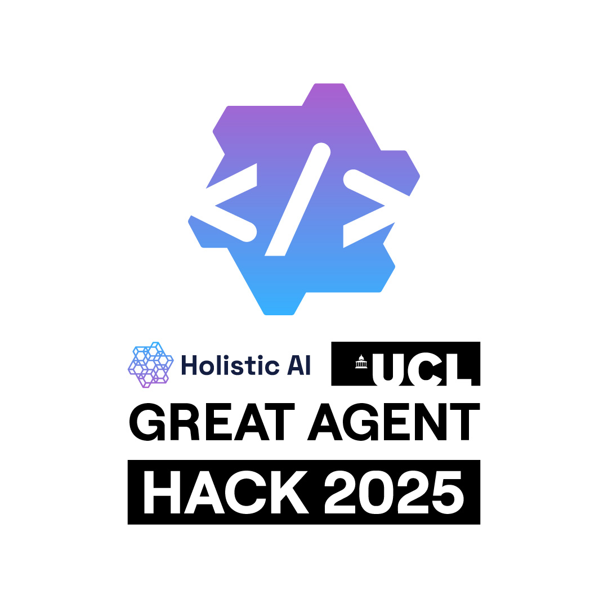

<div align="center">



</div>

# Track B: Agent Glass Box

<div align="center">
<h2>Agent you see. Agent you trust.</h2>
</div>

**Follow the trajectory. Understand the behavior.**

Agents act, remember, observe, and adapt — but why? This track unlocks full transparency: capture every decision step, memory update, and tool interaction. Visualize reasoning trajectories, reveal hidden shortcuts, and enable true auditability. Turn opaque autonomy into explainable behavior.

## What You'll Build

**Choose your use case, build an observable agent.** This track is open-ended — you can pick any application domain and build an agent with full transparency into its decision-making process.

**But here's the key: It's not about what your agent can do — it's about proving you can understand and explain its behavior.**

Your challenge: Can you build an agent where you can trace every decision, understand why it made choices, and explain its reasoning to stakeholders?

**How do you justify observability?**

- **Complete traceability**: Can you trace every decision back to its source? Show us the full execution path.
- **Human-interpretable reasoning**: Can non-technical stakeholders understand what happened? Show us clear visualizations and explanations.
- **Failure analysis**: When things go wrong, can you identify exactly where and why? Show us your debugging capabilities.
- **Behavioral insights**: Can you reveal hidden patterns or shortcuts? Show us what you discovered about your agent's behavior.
- **Actionable transparency**: Does your observability lead to improvements? Show us how insights translate to better agent design.

## Recommended Tutorials

1. [01_basic_agent.ipynb](../tutorials/01_basic_agent.ipynb) - Foundation
2. [02_custom_tools.ipynb](../tutorials/02_custom_tools.ipynb) - Tool integration
3. [03_structured_output.ipynb](../tutorials/03_structured_output.ipynb) - Structured data for better tracing
4. [04_model_monitoring.ipynb](../tutorials/04_model_monitoring.ipynb) - Monitor tokens, costs, and performance
5. [05_observability.ipynb](../tutorials/05_observability.ipynb) - **Deep tracing with LangSmith** ⭐

## AWS Observability Tools

AWS provides multiple services for monitoring and tracing applications, including CloudWatch for logs and metrics, and X-Ray for distributed tracing.

- **AWS CloudWatch**: [CloudWatch Documentation](https://docs.aws.amazon.com/cloudwatch/)
  - Logs, metrics, alarms, dashboards
  - Integration with AWS services
  - Custom metrics and log insights
- **AWS X-Ray**: [X-Ray Documentation](https://docs.aws.amazon.com/xray/)
  - Distributed tracing for microservices
  - Service map visualization
  - Performance bottleneck identification
- **AWS Bedrock Observability**: [Bedrock Monitoring](https://docs.aws.amazon.com/bedrock/latest/userguide/monitoring.html)
  - CloudWatch integration for Bedrock API calls
  - Token usage and latency metrics
  - Cost tracking and usage analytics
- **OpenTelemetry + AWS**: [AWS Distro for OpenTelemetry](https://aws-otel.github.io/)

  - Pre-configured OpenTelemetry collector
  - Integration with CloudWatch and X-Ray
  - Automatic instrumentation for AWS services

- **Relevance to Track B**: Native AWS observability tools for teams deploying on AWS infrastructure. CloudWatch provides comprehensive logging and metrics, while X-Ray offers distributed tracing. Bedrock Observability enables tracking of LLM API calls, token usage, and costs.

## Getting Started with Observability

**→ Start with Tutorial 05: [05_observability.ipynb](../tutorials/05_observability.ipynb)**

The tutorial uses **LangSmith** for tracing and visualization:

- **Documentation**: [LangSmith Documentation](https://docs.smith.langchain.com/)
- **Installation**: `pip install langsmith`
- **Key Features**: Automatic tracing, execution visualization, prompt management, evaluation
- **Quick Start**: Set environment variables (`LANGSMITH_API_KEY`, `LANGSMITH_TRACING=true`) and LangSmith will automatically capture all agent traces

<details>
<summary><strong>Additional Observability Tools</strong> — <em>Click to expand for more options</em></summary>

**OpenTelemetry**

Vendor-neutral, open-source observability framework for cloud-native software. Standardizes collection of traces, metrics, and logs across languages and platforms.

- **Documentation**: [OpenTelemetry Docs](https://opentelemetry.io/docs/)
- **Python SDK**: `pip install opentelemetry-api opentelemetry-sdk`
- **Key Features**: Standardized telemetry collection, vendor-neutral, supports traces/metrics/logs, context propagation, wide language support
- **Relevance to Track B**: Industry standard for observability. Enables vendor-neutral tracing that works with LangSmith, LangFuse, CloudWatch, and other backends.

**LangFuse**

Open-source LLM engineering platform for debugging, analyzing, and iterating on LLM applications. Offers tracing, prompt management, evaluations, and analytics.

- **Documentation**: [LangFuse Docs](https://langfuse.com/docs)
- **GitHub**: [langfuse/langfuse](https://github.com/langfuse/langfuse)
- **Installation**: `pip install langfuse` or self-hosted deployment
- **Key Features**: Automatic tracing with `@observe()` decorator, nested LLM call tracking, OpenTelemetry support, prompt versioning, cost tracking
- **Relevance to Track B**: Excellent alternative to LangSmith with similar capabilities. Supports OpenTelemetry for vendor-neutral observability.

</details>

<details>
<summary><strong>🌟 Featured Research Platforms</strong> — <em>Click to expand</em></summary>

## Featured Research Platforms

**AgentGraph** — Trace-to-Graph Visualization Platform

A trace-to-graph platform for interactive analysis and robustness testing in agentic AI systems (AAAI 2026 Demo Track). Converts execution logs into interactive knowledge graphs with nodes representing agents, tasks, tools, inputs/outputs, and humans, enabling both qualitative failure detection and quantitative robustness evaluation.

- **Paper**: [`examples/agent_graph_AAAI.pdf`](examples/agent_graph_AAAI.pdf) - AAAI 2026 Demo Track
- **Video**: [](https://www.youtube.com/watch?v=btrS9pfDYJY)
- **Key Features**:
  - Converts execution traces into interactive knowledge graphs
  - Visual analysis of agent behavior and decision paths
  - Failure detection across five risk categories
  - Quantitative robustness evaluation
- **Relevance to Track B**: Demonstrates how to transform raw execution traces into interpretable knowledge graphs. Shows practical approaches to making agent behavior human-interpretable.

**AgentSeer** — Observability-Based Evaluation Framework

An observability-based evaluation framework that decomposes agentic executions into granular action and component graphs, enabling systematic agentic-situational assessment of model- and agentic-level vulnerabilities in LLMs.

- **Paper**: [arXiv:2509.04802](https://arxiv.org/abs/2509.04802) - Mind the Gap: Evaluating Model- and Agentic-Level Vulnerabilities in LLMs with Action Graphs
- **Awards**: AAAI 2026 Demo Track, NeurIPS 2025 LLMEval, OpenAI RedTeaming Challenge Winner
- **Demo**: [Hugging Face Spaces](https://huggingface.co/spaces/holistic-ai/AgentSeer)
- **Video**: [](https://www.youtube.com/watch?v=8pDTIIVRwmQ)
- **Key Features**:
  - Decomposes agent executions into granular action graphs
  - Systematic assessment of model-level vs. agentic-level vulnerabilities
  - Identifies "agentic-only" vulnerabilities that emerge in agentic contexts
  - Action and component graph visualization
- **Relevance to Track B**: Demonstrates how observability enables systematic evaluation of vulnerabilities. Reveals key differences between model-level and agentic-level vulnerability profiles. Shows how to go beyond simple tracing to enable deep analysis.

</details>

## Example Systems & Resources

### Execution Traces

LangSmith execution traces from example agent systems. These traces are located in [`traces/`](traces/) and demonstrate different complexity levels.

**ReAct Agent Traces** (Source code: [`../track_a_iron_man/examples/react_agent/`](../track_a_iron_man/examples/react_agent/)):

- [`traces/trace-very-simple.json`](traces/trace-very-simple.json) (13KB) - Very simple single-turn interaction
- [`traces/trace-simple.json`](traces/trace-simple.json) (65KB) - Simple ReAct agent execution with tool calls

**Open Deep Research Traces** (Source code: [`../track_a_iron_man/examples/deep_research/`](../track_a_iron_man/examples/deep_research/)):

- [`traces/trace-normal.json`](traces/trace-normal.json) (251KB) - Normal complexity research workflow
- [`traces/trace-complex.json`](traces/trace-complex.json) (15MB) - Complex multi-agent deep research with multiple sub-agents

<details>
<summary><strong>📊 Understanding Trace Complexity</strong> — <em>Click to expand - Detailed examples and explanations</em></summary>

#### Understanding Trace Complexity

Traces capture the complete execution path of an agent, including every decision, tool call, and state change. Here are examples showing how complexity grows:

**Example 1: Simple Trace (Single Turn, No Tools)**

A basic trace for a single-turn interaction without tool usage:

```json
{
  "name": "ReAct Agent",
  "run_type": "chain",
  "inputs": {
    "messages": [{ "type": "human", "content": "What is a GPU?" }]
  },
  "outputs": {
    "messages": [
      {
        "content": "A GPU, or Graphics Processing Unit...",
        "type": "ai",
        "response_metadata": {
          "model_name": "gpt-4.1-mini-2025-04-14",
          "finish_reason": "stop"
        }
      }
    ]
  },
  "child_runs": []
}
```

**What this shows**: Direct question → LLM response. No tool calls, no reasoning loops, minimal complexity.

**Example 2: Moderate Trace (With Tool Calls)**

A trace showing a ReAct agent using tools:

```json
{
  "name": "ReAct Agent",
  "inputs": {
    "messages": [{ "type": "human", "content": "What are the updates in npm?" }]
  },
  "child_runs": [
    {
      "name": "LLM",
      "outputs": {
        "tool_calls": [
          {
            "name": "search",
            "args": { "query": "latest release notes npm" }
          }
        ]
      }
    },
    {
      "name": "search",
      "inputs": { "query": "latest release notes npm" },
      "outputs": {
        "results": [
          { "url": "...", "title": "...", "content": "..." },
          { "url": "...", "title": "...", "content": "..." }
        ]
      }
    },
    {
      "name": "LLM",
      "outputs": {
        "messages": [
          {
            "content": "The latest release of npm is version 11.5.2...",
            "type": "ai"
          }
        ]
      }
    }
  ]
}
```

**What this shows**: User query → LLM decides to search → Tool execution → LLM synthesizes results. Multiple steps, tool integration, reasoning loop.

**Example 3: Complex Trace (Multi-Agent, Nested Workflows)**

A simplified view of a complex multi-agent trace:

```json
{
  "name": "Deep Research Agent",
  "child_runs": [
    {
      "name": "Research Planner",
      "child_runs": [
        {"name": "Sub-question Generator", "child_runs": [...]},
        {"name": "Research Strategy", "child_runs": [...]}
      ]
    },
    {
      "name": "Research Executor",
      "child_runs": [
        {
          "name": "Sub-agent 1: Topic A",
          "child_runs": [
            {"name": "Web Search", "child_runs": [...]},
            {"name": "Content Extraction", "child_runs": [...]},
            {"name": "Synthesis", "child_runs": [...]}
          ]
        },
        {
          "name": "Sub-agent 2: Topic B",
          "child_runs": [
            {"name": "Web Search", "child_runs": [...]},
            {"name": "Content Extraction", "child_runs": [...]},
            {"name": "Synthesis", "child_runs": [...]}
          ]
        }
      ]
    },
    {
      "name": "Report Generator",
      "child_runs": [
        {"name": "Section Writer", "child_runs": [...]},
        {"name": "Review Agent", "child_runs": [...]}
      ]
    }
  ]
}
```

**What this shows**:

- **Nested hierarchy**: Multiple levels of agent → sub-agent → tool calls
- **Parallel execution**: Multiple sub-agents working simultaneously
- **State management**: Context passing between agents
- **Complexity**: 15MB trace file with thousands of nested operations

**Why Traces Get Complex**:

1. **Multi-agent systems**: Each agent spawns its own trace subtree
2. **Tool chains**: Each tool call can trigger additional operations
3. **State management**: Traces capture state transitions and context passing
4. **Error handling**: Retries, fallbacks, and error recovery add layers
5. **Parallel execution**: Concurrent operations create branching structures
6. **Memory operations**: Retrieval, storage, and updates are all traced

**How to Use Traces**:

1. **Analyze structure**: Understand how LangSmith captures agent execution
2. **Study patterns**: See how different complexity levels affect trace structure
3. **Compare systems**: Compare ReAct Agent traces vs. Open Deep Research traces
4. **Visualize**: Use LangSmith UI or build custom visualizations (like AgentGraph)
5. **Learn**: Understand what observability data is captured at each step
6. **Debug**: Use traces to identify where failures occur in complex workflows
7. **Optimize**: Find bottlenecks and unnecessary operations in agent execution

</details>

## Datasets & Benchmarks

**Who_and_When Dataset** ([`examples/failure_attribution/`](examples/failure_attribution/))

An agent trace database for automated failure attribution in multi-agent systems. Contains execution traces with fine-grained annotations identifying which agent caused failures and when critical errors occurred.

- **Dataset**: [Who_and_When](https://huggingface.co/datasets/Kevin355/Who_and_When) - 184 annotated failure tasks from algorithm-generated and hand-crafted systems
- **Paper**: [arXiv:2505.00212](https://arxiv.org/pdf/2505.00212)
- **Relevance to Track B**: Rich database of agent execution traces with failure annotations, demonstrating how to identify failure points in agent trajectories

## Track-Specific Submission Focus

Include observability traces, reasoning visualizations, trajectory analysis, and documentation of how you achieved transparency and explainability.

For complete requirements, see [README.md](../README.md#-registration--submission) and [HACKATHON_RULES.md](../docs/HACKATHON_RULES.md).
